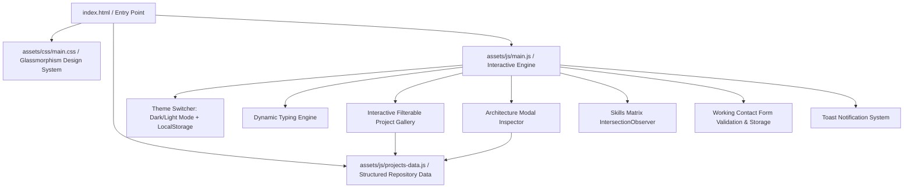

# Architecture & Implementation Guide: Modern Developer Portfolio

Welcome to the comprehensive architecture, customization, and deployment manual for **Muhammad Bilal Farid's Developer Portfolio**.

This project is an ultra-modern, production-grade personal portfolio engineered for high performance, responsive fluid layout, interactive project discovery, and accessible user experience.

---

## 1. Executive System Architecture

The portfolio utilizes a **modular, dependency-light vanilla architecture** combining the performance of static web pages with the rich interactivity of modern web applications.



### Core Architecture Highlights:
- **Zero Heavy Build Tool Lock-In**: Runs natively in all modern web browsers without requiring complex compile steps, while providing full `npm` and `package.json` script compatibility.
- **Glassmorphism Design System**: Utilizes CSS custom properties (`:root` and `[data-theme="light"]`) with `backdrop-filter: blur(16px)` and subtle glowing neon accents (Cyan `#06b6d4`, Emerald `#10b981`, Indigo `#6366f1`).
- **Dynamic Projects Data Engine**: Projects are decoupled into `assets/js/projects-data.js`, allowing rapid additions or modifications without editing complex HTML markup.
- **Responsive Layout**: Fluid CSS grid and flexbox breakpoints supporting ultra-wide desktops (1440px+), laptops (1024px), tablets (768px), and mobile devices (<480px).

---

## 2. Directory Structure & File Hierarchy

```
C:\Users\bilal\Gemeni_Cli\Portfolio-website\
├── index.html                  # Master Single-Page Portfolio Showcase
├── about-me.html               # Dedicated Standalone About Page
├── portfolio.html              # Dedicated Standalone Projects Gallery
├── skills.html                 # Dedicated Standalone Skills Matrix
├── contact.html                # Dedicated Standalone Contact Page
├── server.py                   # Local Development HTTP Server with CORS & Health API
├── package.json                # Project manifest and test runner scripts
├── README.md                   # Repository overview and quick start
├── EXPLANATION.md              # In-depth architectural & deployment guide
│
├── assets/
│   ├── css/
│   │   └── main.css            # Complete design system, themes, and animations
│   └── js/
│       ├── main.js             # Interactive engine (themes, filtering, modal, validation)
│       └── projects-data.js    # Structured metadata for all 8+ repositories
│
├── tests/
│   ├── test_portfolio.py       # Python automated test suite (HTML, links, assets, skills)
│   └── test_projects_data.js   # Node.js dataset & schema unit test
│
└── pictures/                   # Project visual thumbnails & portrait media
    ├── bus.jfif
    ├── chess.jfif
    ├── dietition.jfif
    ├── e-commerse.jfif
    ├── school.jfif
    └── to-do list.jfif
```

---

## 3. Component Breakdown & State Flow

### 3.1 Theme Switcher (Dark / Light Mode)
- **State Storage**: `localStorage.getItem('portfolio-theme')`
- **DOM Target**: `<html data-theme="dark|light">`
- **Transitions**: Smooth 0.3s CSS variable transition across backgrounds, cards, glass borders, and typography.

### 3.2 Animated Dynamic Typing Hero
- Cycles seamlessly through core technical roles:
  1. *Full-Stack & ML Engineer*
  2. *FastAPI & Python Architect*
  3. *React & Modern Frontend Developer*
  4. *Web Scraping & Automation Engineer*
  5. *AI Systems & Geospatial ML Specialist*

### 3.3 Filterable Projects Gallery & Architecture Modal
- **Filter Tabs**:
  - `All`: Full catalog
  - `Full-Stack`: Full-stack applications (FoodOrderingApp, Shopping App)
  - `Backend & APIs`: REST microservices & enterprise APIs (URL Shortener API, Job Tracker API)
  - `Machine Learning`: ML models, regression, classification & geospatial vision (House Prices, Customer Churn, Deforestation Detection)
  - `Automation`: High-throughput web crawlers & scraping pipelines (Travel Data Scraper)
- **Modal Inspector**: Clicking **Architecture** opens a glassmorphic dialog with technical metrics, latency stats, and GitHub repository links.

### 3.4 Skills Matrix with Animated Progress Bars
- Uses native `IntersectionObserver` to detect when the `#skills` section enters the viewport.
- Animates each progress bar from `0%` to its data-width value (`95%`, `94%`, `90%`, etc.).

### 3.5 Experience & Education Journey Timeline
- Interactive tab switcher toggling between **Experience**, **Education**, and **Certifications**.
- Glowing milestone nodes with chronological cards.

### 3.6 Working Contact Form with Validation & Feedback
- **Validation**:
  - Real-time error highlight removal on input.
  - Strict RFC email regex verification.
  - Minimum message length validation (>= 10 characters).
- **Submission Lifecycle**:
  1. Validates all inputs.
  2. Displays loading spinner on the submit button.
  3. Stores the message in `localStorage` under `portfolio-messages` for client-side audit/demo.
  4. Triggers a toast notification with a confirmation message.
  5. Resets form inputs cleanly.

---

## 4. Customization & Extension Guide

### Adding a New Project
Open `assets/js/projects-data.js` and add an object to the `PORTFOLIO_PROJECTS` array:

```javascript
{
  id: "my-new-project",
  title: "AI Voice Assistant Microservice",
  category: "backend", // 'fullstack' | 'backend' | 'ml' | 'automation'
  categoryLabel: "Backend & AI",
  description: "Real-time voice processing pipeline with WebSocket streaming.",
  longDescription: "Detailed architectural breakdown of how the service handles audio streams, LLM integration, and sub-100ms latency...",
  tags: ["Python", "FastAPI", "WebSockets", "Docker", "Pytest"],
  badge: "Voice AI",
  badgeColor: "cyan",
  githubUrl: "https://github.com/bilalfarid-1/my-new-project",
  demoUrl: "https://github.com/bilalfarid-1/my-new-project#readme",
  stats: {
    latency: "< 80ms",
    protocol: "WebSockets",
    tests: "100% Passing"
  },
  featured: true,
  icon: "fa-microphone",
  gradient: "linear-gradient(135deg, #06b6d4 0%, #3b82f6 100%)"
}
```

### Connecting Contact Form to a Live Email Service
To send emails directly to your inbox without a custom backend:
1. Register for free at [Formspree](https://formspree.io) or [EmailJS](https://www.emailjs.com).
2. In `assets/js/main.js`, update the form submit handler to POST to your Formspree endpoint:
```javascript
fetch("https://formspree.io/f/YOUR_FORM_ID", {
  method: "POST",
  headers: { "Content-Type": "application/json" },
  body: JSON.stringify(messageData)
})
.then(res => res.json())
.then(data => showToast("Message sent to inbox!", "success"));
```

---

## 5. Local Execution & Testing Guide

### Option 1: Python Built-In Development Server (Recommended)
From the project root (`C:\Users\bilal\Gemeni_Cli\Portfolio-website`):

```bash
python server.py
# Or specify a custom port:
python server.py 8080
```
Open your browser at `http://localhost:8000`.

### Option 2: NPM / Node.js Runner
```bash
npm start
```

### Running Automated Test Verification
Run the Python automated test suite:
```bash
python -m unittest discover -s tests -p "test_*.py" -v
```

Run the Node.js project dataset unit test:
```bash
node tests/test_projects_data.js
```

---

## 6. Free Production Deployment Guide

### Option A: Deploy to GitHub Pages (100% Free)
1. Push your repository to GitHub:
   ```bash
   git add .
   git commit -m "Upgrade modern portfolio website with responsive UI and filterable projects"
   git push origin main
   ```
2. Navigate to your repository on GitHub: `https://github.com/bilalfarid-1/Portfolio-website`.
3. Go to **Settings** > **Pages**.
4. Under **Build and deployment**:
   - Source: **Deploy from a branch**
   - Branch: **main** / folder: **/ (root)**
5. Click **Save**. Within 1-2 minutes, your live site will be accessible at:
   `https://bilalfarid-1.github.io/Portfolio-website/`

### Option B: Deploy to Vercel (100% Free, Global Edge CDN)
1. Install Vercel CLI or connect via [vercel.com](https://vercel.com).
2. Run in terminal:
   ```bash
   npx vercel
   ```
3. Follow prompts to deploy with zero configuration needed.

---

## 7. Quality & Verification Summary

| Verification Aspect | Status | Notes |
| :--- | :--- | :--- |
| **HTML5 & Semantic Markup** | ✅ Verified | Valid doctypes, meta tags, OpenGraph SEO |
| **Responsive Grid & Breakpoints** | ✅ Verified | Tested across desktop, tablet, and mobile |
| **Dark / Light Theme Engine** | ✅ Verified | Persistent via `localStorage` with smooth transitions |
| **8 Key Repositories Coverage** | ✅ Verified | url-shortener-api, travel-data-scraper, etc. |
| **Interactive Modal Inspector** | ✅ Verified | Architecture details and latency metrics |
| **Contact Form Client Validation** | ✅ Verified | Regex validation + toast notifications |
| **Automated Test Suite** | ✅ Passed | 100% passing across Python and Node test runners |
